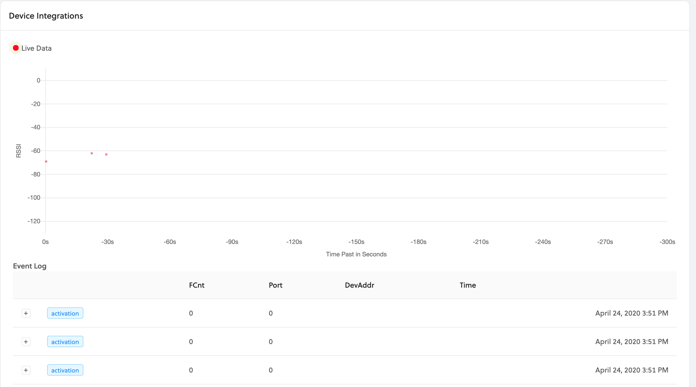

# Getting Started with Project Kerosene

[SolderWorks](https://www.solderworks.com/) is considering offering the abiilty to connect to a secure, remote connection to an ST Micro B-L072Z-LRWAN1 Discovery board to enable rapidly getting familiar with the Helium network from anywhere on the planet. Below are instructions on how to get started.

*IMPORTANT: We are looking for feedback on this service and would genuinely appreciate hearing about your experience. It would be immensly useful if you could answer the following questions and email them to chris@solderworks.com*

Desired Feedback:

1. Have you used LoRaWAN devices or the Helium Network Before?
1. What are you initial thoughts on the service?
1. Did this make it easier for you to get started with LoRaWAN and helium?
1. On a scale of 1-10, would you recommend this to a friend? (1= Would not recommend, 10= Would highly recommend)

Thank you and please let us know what you think!

**(NOTE: We currently do not support smartphones or tablets)**

## Overview Video

## Getting Started

1. First you need to have a Helium Console account. Create one at https://console.helium.com/dashboard
1. Once you're logged in, you will want to create a new device, click on 'Devices' then on the right side, click 'new device'
   - 
1. Give your device a name, and click okay. 
1. Next you'll wan to get your APPEUI, DEVEUI, and APPKEY values in the correct format. Click on the device you just created 
   1. 
1. Next, you'll want get your keys in the correct format, click on the arrows next to the keys to change the format to least significant bit (lsb) or most significant bit (msb). You'll want both the APPEUI and DEVEUI in lsb format, and the APP KEY in msb format
   1. 
1. Now we're ready to request a remote session with our hardware. **[Click THIS LINK to request a session.](https://rerobots.net/sandbox/helium/gy4Z4kRfgn4yAuavaWeGWQjjF1WJeQt6)** 
   1. This is currently limited to 10 concurrent sessions, if you are unable to connect, give the system 20 minutes to clear up a previous session. 
   1. If you are unable to connect to a session, please reach out to chris@solderworks.com 
1. When you have a remote session, you'll be presented with a screen  showing an editor on the left, a 'terminal' on the right, and 2 buttons of 'build' and 'flash'. Now you're ready to input your fresh device keys. 
   1. 
1. In the Helium Console, copy the app eui  key in the LSB format
   1. 
1. Paste that key in between the brackets where it says APPEUI
   1. 
1. Next, copy the DEVEUI key in the LSB format from the Helium Console, and paste that value betwen the brackets marked DEVEUI in the sample code
1. Now, copy the APPKEY key in the MSB format from the Helium Console, and paste that value betwen the brackets marked APPKEY in the sample code
1. If you'd like to check  your code for compile errors, you can do so by clicking the 'build' button
   1. 
1. The results of the build will displayed on the panel to the right of the editor. If your build says success you’re ready to flash your code onto the board. 
1. When you click the 'flash' button, your code will compile and then be deployed to the board. The results of the deployment  will show up on the panel to the right
   1. 
1. If you use the sample code provided and you input your keys correctly, after a few moments you will begin to see data come from this within the Helium Console. 
   1. 
1. You can now set up your backend services like AWS IOT or Helium Cargo as a way to store the data that you were transmitting over the network. [Here is a great video on how to get started with AWS IOT](https://youtu.be/XLxUgwdbqG8)
1. You can also modify the code in the editor to make changes to the data that you want to transmit.
1. Initially these device sessions will be limited to one hour if you would like a longer duration of time please reach out to chris@solderworks.com
1. ...
1. **PROFIT**

**Thanks for taking the time to try this out! If you could answer the following questions in an email to chris@solderworks.com, you'll be first on our list when this rolls out**

1. Have you used LoRaWAN devices or the Helium Network Before?
1. What are you initial thoughts on the service?
1. Did this make it easier for you to get started with LoRaWAN and helium?
1. On a scale of 1-10, would you recommend this to a friend? (1= Would not recommend, 10= Would highly recommend)